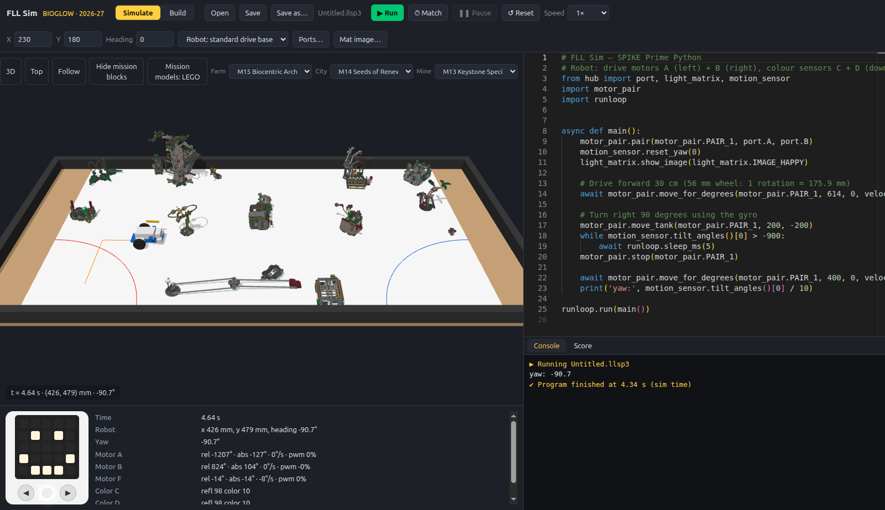
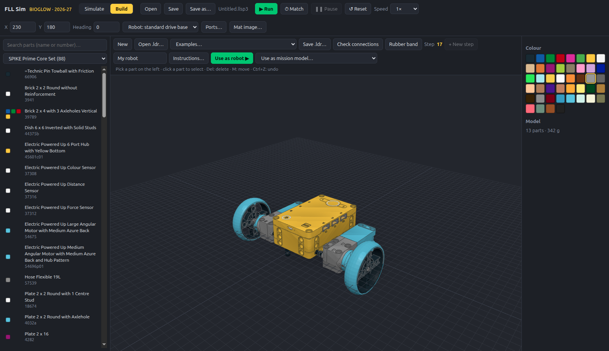
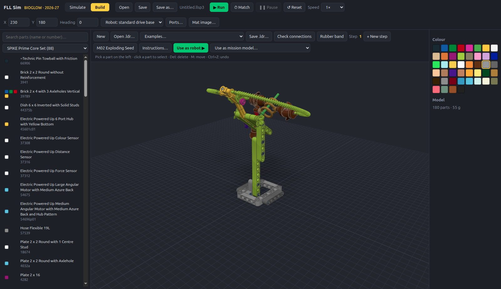
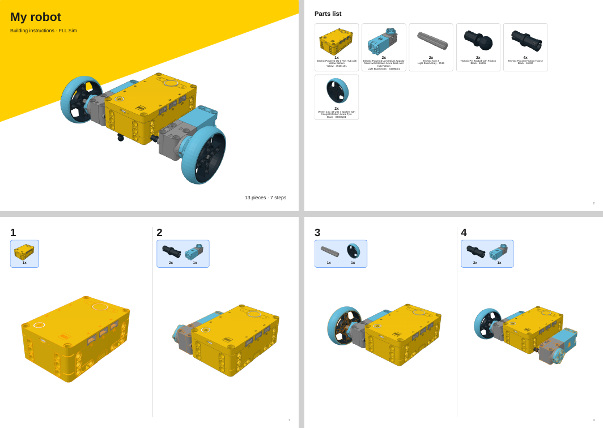
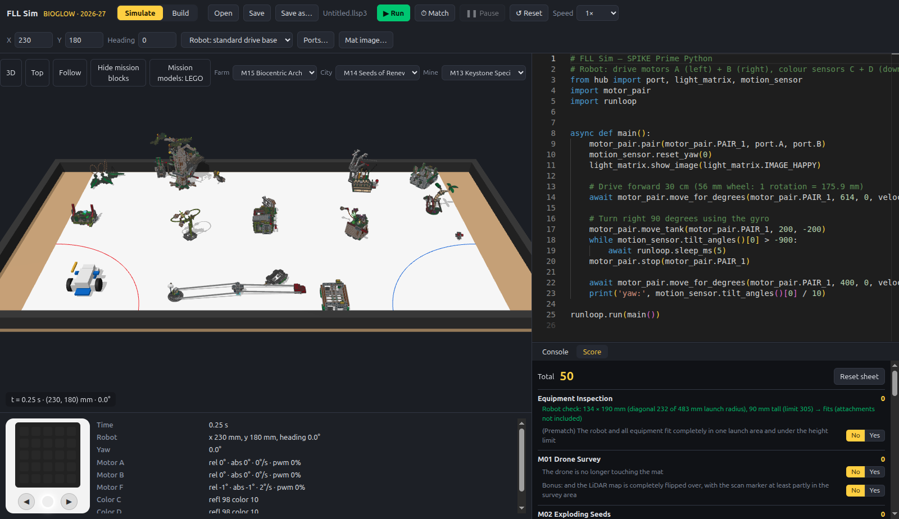

# FLL Sim

A desktop simulator for **FIRST LEGO League Challenge** teams using **LEGO Education SPIKE Prime**.
Write SPIKE Python, run it on a to-scale competition table, and watch the robot drive, turn,
and read its sensors — away from the physical robot. Runs on Debian/Ubuntu (and other Linux).

Current season pack: **2026-27 BIOGLOW**.



| Build robots from real LEGO parts | Every mission model, part by part |
|---|---|
|  |  |
| **Export LEGO-style building instructions** | **Official scoresheet with live total** |
|  |  |

*(Screenshots show a plain mat: FIRST's mat artwork is copyrighted and isn't part of this
repository. Load your own copy with **Mat…**; see "Season materials and the mat".)*

## Status

| Milestone | State |
|---|---|
| M0 Foundation — monorepo, Electron app, `.deb` / AppImage packaging, CI | ✅ |
| M1 Table — table + walls to spec, mat to scale, launch areas, mat import | ✅ (mat size to verify with a tape measure) |
| M2 Drive base — Rapier physics, SPIKE motor model (profiles, PID, stop modes, stall) | ✅ |
| M3 Python — real MicroPython (WASM) in lockstep with sim time, SPIKE 3 API | ✅ |
| M4 Sensors — colour (samples the mat), distance, IMU; telemetry panel | 🟡 force sensor + calibration UI pending |
| M5 Word Blocks + `.llsp3` | ✅ visual Word Blocks editor (SPIKE App blocks), `.llsp3` open/save in the SPIKE App's format, Python view |
| M6 LEGO builder (LDraw parts, snapping, connectivity) | 🟡 real-part builder, connection → physics (rigid groups, hinges, motor axles), real-parts SPIKE drive base; gears and part thumbnails pending |
| M7 BIOGLOW mission models + scoring | 🟡 official scoresheet + auto total (incl. Challenge Update 01), 2:30 match mode, auto equipment inspection, all 13 mission books built from real LEGO parts and placed on their mat marks (see below); exact orientation of M08/09 still to confirm on a real table |
| M8 Real-robot calibration, replay, polish | 🟡 calibration kit, replay + run comparison, automatic scoring, matches with launches from home, preset driving bases and tools; real-robot measurements pending |

See `PLAN.md` for the full design.

## Installing on a team laptop

Build the packages once (`pnpm dist:linux`, output in `apps/desktop/release/`), then on each
laptop (Debian 12+ / Ubuntu 22.04+, 64-bit):

- **.deb:** `sudo apt install ./fll-sim_0.1.0_amd64.deb`, then start **FLL Sim** from the
  applications menu (or run `fll-sim`).
- **AppImage** (no install, no admin rights): `chmod +x fll-sim-0.1.0-x86_64.AppImage` and
  double-click it. On systems without FUSE 2 run it with `--appimage-extract-and-run`.

**First start: load the mat.** FIRST's mat artwork can't be shipped with the app. Copy your
prepared mat image (`resources/2026-27-bioglow/derived/mat-color.png` from the computer where it
was made; see "Season materials and the mat") to the laptop, click **Mat image…** and pick it. The
app remembers it. Without it the table shows a plain mat with the launch areas; everything else
works.

Both packages were checked by installing the `.deb` contents and running the AppImage: the
app starts, loads every mission model and runs a program.

## Running from source

On a fresh Debian/Ubuntu machine (or WSL2), one command installs everything (system libraries,
Node.js 22 and pnpm in `~/.local/node`, the code in `~/fll-sim`), builds the app, adds **FLL Sim**
to the app menu and starts it:

```sh
curl -fsSL https://raw.githubusercontent.com/martijas/fll-sim/main/setup.sh | bash
```

(Run `./setup.sh` again in the checkout to update; `--no-launch` skips starting the app.)
By hand: Node.js 22+ and pnpm (`corepack enable`), then:

```sh
pnpm install
pnpm dev            # launch the app with hot reload
pnpm test           # physics + Python conformance tests
pnpm typecheck
pnpm dist:linux     # build apps/desktop/release/fll-sim_<ver>_amd64.deb and an AppImage
sudo apt install ./apps/desktop/release/fll-sim_0.1.0_amd64.deb
```

**WSL (Windows):** needs Windows 11 (or 10 with WSLg) so Linux windows can open, plus the
libraries Electron uses: `sudo apt install libnss3 libgtk-3-0 libgbm1 libasound2 libxss1`. If
`pnpm dev` ever says *Electron uninstall*, run `pnpm install` again (it downloads Electron) or
`node -e "require('electron')"` in `apps/desktop`.

Headless runs (CI, batch testing of programs):

```sh
pnpm sim run my_program.llsp3 --start 230,180,0 --trace trace.json
# FIRST's BIOGLOW guided mission (Word Blocks), robot wired like the SPIKE lesson:
pnpm sim run resources/2026-27-bioglow/code/guided-mission-bioglow-11.llsp3 \
  --start 300,350,-90 --drive C,D --color B --distance none --motors E
```

## Word Blocks

Programs can be written in Word Blocks, as in the SPIKE App: the editor has the same categories,
blocks and wording (motors, movement, light, sound, events, control, sensors, operators,
variables and My Blocks). **New… → Word Blocks project** starts one; SPIKE App `.llsp3` files open
directly and **Save** writes them back in the SPIKE App's own format, so the same file goes to the
real hub. Blocks the simulator doesn't model (music, weather, …) are kept unchanged.

The blocks run as Python on the same simulated hub (**Python view** shows what they run as, so
timing and physics are identical to Python programs). If a block raises an error (e.g. a motor
block on a port with a sensor), that block is selected in the editor. The program you were
working on is there again when the app restarts. **Convert to Python** continues in Python.

## Building robots with real LEGO parts

The **Build** tab places real parts from the LDraw library — the SPIKE Prime Core and Expansion
sets and the BIOGLOW Challenge Set are in the catalog. Parts snap together at their real
connection points (studs, pin holes, axles). **Check connections** shows how the model will
behave physically: parts held by studs, axles in axle holes, or two or more pins become one rigid
group; a single pin or an axle in a round hole becomes a hinge; SPIKE motors drive their output
hub. **Use as robot** puts the build on the field. Models save as standard `.ldr` files (open
them in LDCad, LeoCAD or Studio); motor/sensor ports are stored as `0 !FLLSIM PORT X` lines.

Part geometry: [LDraw Parts Library](https://library.ldraw.org) (CC BY 4.0). Connection data:
[LDCad Shadow Library](https://github.com/RolandMelkert/LDCadShadowLibrary) (CC BY-SA 4.0).
Inventories: [Rebrickable](https://rebrickable.com). See `apps/desktop/resources/ldraw/ATTRIBUTION.txt`.
Rebuild the bundled pack with `pnpm --filter @fll-sim/ldraw-pack run build-pack` (needs the LDraw
library in `~/.cache/fll-sim/ldraw`, the shadow library in `~/.cache/fll-sim/shadow` and the
Rebrickable CSV dumps in `~/.cache/fll-sim/rebrickable`).

### How parts behave in the simulator

- **Pins:** friction pins (black, blue, dark grey 3L) hold a beam in place and slip above ~6 mN·m;
  frictionless pins (light grey, tan) spin freely. Decided by the part number, as LEGO does.
- **Axles:** an axle in a round hole turns *and* slides until a bush, gear or beam on it meets the
  hole's beam (or it would leave the hole); a bar in an axle hole turns snugly.
- **Gears:** meshing gears are found from their tooth counts and spacing (8/12/16/20/24/28/36/40
  teeth, double bevels, bevels at 90°, worms, turntables) and turn each other at the exact ratio;
  worms can't be turned back from the gear.
- **Clips and hinges:** a bar in a clip and click hinges / hinge bricks are stiff hinges that hold
  their angle.
- **Coming apart:** on your robot, a small group held on by only 1-2 studs pops off when knocked
  (~2 N per stud). Mission game pieces are held where they sit until pushed (M02 seeds, M04
  katydid).
- **Strings and chains** are ropes (slack or taut) between what they tie; **rubber bands** (Build
  tab → *Rubber band*, click two parts) pull their ends together; label a band `rest=50% k=0.08`
  to change its unstretched length or strength.
- **Grip:** tyres ≈ 1.0, smooth racing tyres 1.1, rubber 0.9, plastic tracks 0.4, plastic 0.3,
  steel ball casters 0.12 (against the mat). All of these are estimates to calibrate on a real
  table.

## Calibrating against your real robot

**Calibrate…** (next to **Ports…**) makes the simulated robot match your real one; it takes about
15 minutes at the table:

1. Set your robot's ports, wheel size and track width in **Ports…**.
2. In **Calibrate…**, save the five test programs (*Save program…*) and open them in the SPIKE
   App. They are Python projects, which the SPIKE App runs even if your team codes in Word Blocks.
3. Run them on the robot on the real mat: drive straight (measure how far the front moved and
   type it in), spin in place, top speed, coast to a stop, and colour sensor over white then a
   black line (press the right button when the sensor is over the line).
4. Copy everything the SPIKE console printed into the box (only the `CAL,…` lines matter).
5. Click **Run the tests in the simulator**; the table then compares the real robot with the
   simulated one, and **Apply corrections** updates the effective wheel size, turning width and
   colour sensor calibration.

The comparison also shows the difference in top speed, acceleration, coasting and straight-line
drift, which tells you what else to adjust.

## Robots, tools and matches

The robot menu has the standard drive base (ports set with **Ports…**), the preset driving
bases from FIRST's robot guides, and your own build from the Build tab. **Tools ▾** puts modular
tools on the robot: a tool goes on at a **mount point** with the same name as one of its own, so
it always attaches the same way. Mount points aren't real parts — in the Build tab, **Mount
point** marks one (name it in the side panel) on a robot and on a tool, at the spot where they
join; **Use as tool** keeps the current build as a tool.

**⏱ Match** plays a match by the rulebook: after each launch the robot may only be handled when
it is completely in a home area — then you can change tools, the program or its position and
**Launch** again, with the field as the robot left it. If it stops outside home, bringing it back
costs a precision token. **■ Stop** during a match interrupts the robot instead of resetting the
field, and the 2:30 clock keeps running between launches.

After a run, **⟲ Replay last run** scrubs through it (robot, field and telemetry), and earlier
runs stay on the mat as dashed paths (**Runs** panel) to compare with.

## Missions and scoring (BIOGLOW)

All 13 BIOGLOW mission books ship as real-LEGO models (`apps/desktop/resources/missions/*.ldr`,
poses in `seasons/2026-27/mission-models.json`), scripted part by part from the official building
instructions and placed on the mat by matching their footprint against the wireframe marks.
On the field:

- the heaviest body resting on the mat is held by Dual Lock; hinges, levers and game pieces move
  under physics; parts whose connection isn't in the snap data (flexible hoses, clips, some
  decorations) are glued to what they touch;
- game pieces are tagged in their part labels (`[loose:<piece>]`) so they stay free;
- a model stays frozen exactly as set up until the robot comes near it (fast, and like the
  friction that holds a real model still), then all its parts come alive.

**Mission models: LEGO / blocks** switches to simple blocks (faster). Your own build replaces a
model via **Use as mission model…** in the Build tab (**Reset … to default** restores it). The
Build tab's **Examples…** menu opens every mission model, e.g. to print its instructions.
The **Score** tab is the official scoresheet with the total calculated as you answer. At the end
of a match (and with **Auto-score from field**) it fills in what it can judge from the simulated
field — marked *auto* — and leaves the rest (things decided by pictures in the rulebook, your
keystone species' trees, precision tokens) for you to answer. Your keystone species (M13) is a
build of your own: **Use as mission model… → M13 keystone species** in the Build tab.

### Building instructions

**Instructions…** in the Build tab exports any model (your robot, attachments, a mission model)
as a LEGO-style building guide (PDF or HTML): a cover, the parts list with quantities and colours,
and numbered steps with a parts callout and the new parts outlined. Steps come from the builder's
step control (**+ New step**); models without steps get one part per step.

### Maintaining the mission models (`tools/model-build`)

- `models/<id>.ts` rebuild a book: `pnpm --filter @fll-sim/model-build run build-model <id> -- --views`
  (needs the building instructions in `resources/`, see `tools/model-build/MODEL_GUIDE.md`).
- `pnpm exec tsx src/publish.ts [book ...]` (in `tools/model-build`) splits books into field
  models, finds their pose on the mat and writes the app's mission files.
- `pnpm run field-check [id] [--wake] [--render]` checks the models' physics on the field.

## Season materials and the mat

FIRST's season documents (rulebook, mission model instructions, mat wireframe) are copyrighted
and are **not** in this repository. Download them from the FIRST season materials page into
`resources/2026-27-bioglow/` (git-ignored). To make a mat texture:

```sh
python3 tools/mat-import/import_mat.py resources/2026-27-bioglow/field/wireframe-grid.pdf \
  --page 2 --mat-mm 2000x1140 --out resources/2026-27-bioglow/derived/mat-wireframe.png
```

For the colour mat (recommended — the colour sensor reads the real artwork):

```sh
python3 tools/mat-import/compose_color_mat.py --rulebook resources/2026-27-bioglow/rules/robot-game-rulebook.pdf \
  --wireframe resources/2026-27-bioglow/derived/mat-wireframe.png --out resources/2026-27-bioglow/derived/mat-color.png
```

In the app, **Mat…** loads FIRST's mat print file (PDF; the white margin is trimmed) or a
scan/photo of your printed mat (cropped exactly to the mat edges); it is remembered per season. The colour sensor reads this image, so a colour-accurate scan gives
the most realistic line-following.

## The simulated robot

Default drive base: drive motors **A** (left) and **B** (right, both medium motors, 56 mm wheels,
120 mm track), colour sensors **C** and **D** pointing down at the front, distance sensor **E**
facing forward, attachment motor **F**. Use **Robot…** to rewire ports to match your robot
(presets include the SPIKE guided-mission robot: drive C+D, colour B, arm E). Start pose is set with X / Y (mm on the mat, origin at the south-west corner)
and heading (degrees, 0 = facing north/away from the south wall).

## Known differences from a real hub (to be calibrated — see plan M8)

- Motor torque/friction and wheel grip are estimates; yaw sign convention and IMU axes need
  confirming on a real hub.
- `time.sleep_ms` and every hub call advance simulated time; pure-Python loops that never call
  the hub don't (use Stop).
- Colour-sensor reflection values depend on your mat image; calibrate against real readings.
